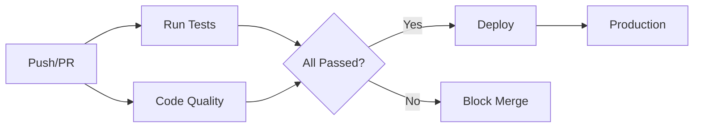

# 🚀 Todo API Pipeline

[](https://github.com/ernanegit/todo-api-pipeline/actions)
[](https://python.org)
[](https://flask.palletsprojects.com)
[](https://github.com/psf/black)

Uma API REST completa para gerenciamento de tarefas (Todo List) com pipeline CI/CD automatizado usando GitHub Actions.

## 📋 Sobre o Projeto

Este projeto demonstra a implementação de um **pipeline CI/CD profissional** com:

- ✅ **API REST** completa em Python Flask
- ✅ **Testes automatizados** com pytest
- ✅ **Qualidade de código** com Black e Flake8
- ✅ **Deploy automático** simulado
- ✅ **Pull Request workflow** com proteções
- ✅ **Execução paralela** de jobs

## 🛠️ Tecnologias Utilizadas

- **Backend**: Python 3.9, Flask 2.3.3
- **Testes**: pytest 7.4.0
- **CI/CD**: GitHub Actions
- **Qualidade**: Black (formatação), Flake8 (linting)
- **Versionamento**: Git/GitHub

## 📊 Pipeline CI/CD



### Jobs do Pipeline

| Job | Descrição | Tempo Médio |
|-----|-----------|-------------|
| **Run Tests** | Executa testes unitários e de integração | ~13s |
| **Code Quality** | Verifica formatação e linting | ~11s |
| **Deploy** | Simula deploy em produção (só na main) | ~5s |

## 🚀 Endpoints da API

### 📖 Documentação da API

| Método | Endpoint | Descrição | Status |
|--------|----------|-----------|--------|
| `GET` | `/health` | Status da aplicação | ✅ |
| `GET` | `/todos` | Lista todas as tarefas | ✅ |
| `POST` | `/todos` | Cria nova tarefa | ✅ |
| `GET` | `/todos/<id>` | Busca tarefa por ID | ✅ |
| `DELETE` | `/todos/<id>` | Remove tarefa | ✅ |

### 📝 Exemplos de Uso

**Verificar saúde da API:**
```bash
curl http://localhost:5000/health
```

**Listar todas as tarefas:**
```bash
curl http://localhost:5000/todos
```

**Criar nova tarefa:**
```bash
curl -X POST http://localhost:5000/todos \
  -H "Content-Type: application/json" \
  -d '{"task": "Aprender DevOps"}'
```

**Buscar tarefa específica:**
```bash
curl http://localhost:5000/todos/1
```

**Deletar tarefa:**
```bash
curl -X DELETE http://localhost:5000/todos/1
```

## 🏃‍♂️ Como Executar

### Pré-requisitos

- Python 3.9+
- Git

### Instalação

```bash
# Clone o repositório
git clone https://github.com/ernanegit/todo-api-pipeline.git
cd todo-api-pipeline

# Instale as dependências
pip install -r requirements.txt

# Execute a aplicação
python app.py
```

A API estará disponível em `http://localhost:5000`

### Executar Testes

```bash
# Executar todos os testes
pytest tests/ -v

# Executar com coverage
pytest tests/ --cov=./
```

### Formatação do Código

```bash
# Formatar código
black .

# Verificar linting
flake8 . --max-line-length=88
```

## 🔄 Workflow de Desenvolvimento

### Para Novas Features

```bash
# 1. Criar branch feature
git checkout -b feature/nova-funcionalidade

# 2. Desenvolver e testar
# ... fazer mudanças ...

# 3. Commit e push
git add .
git commit -m "feat: adicionar nova funcionalidade"
git push origin feature/nova-funcionalidade

# 4. Abrir Pull Request no GitHub
# 5. Aguardar aprovação dos checks automáticos
# 6. Fazer merge após aprovação
```

### Pipeline Automático

O pipeline é executado automaticamente em:

- ✅ **Push** para `main` ou `develop`
- ✅ **Pull Requests** para `main`
- ✅ **Execução manual** via GitHub Actions

## 📁 Estrutura do Projeto

```
todo-api-pipeline/
├── .github/
│   └── workflows/
│       └── ci-cd.yml          # Configuração do pipeline
├── tests/
│   └── test_app.py           # Testes automatizados
├── app.py                    # Aplicação Flask principal
├── requirements.txt          # Dependências Python
└── README.md                # Documentação (este arquivo)
```

## 🧪 Testes

### Cobertura de Testes

- ✅ **Health check** endpoint
- ✅ **CRUD operations** completo
- ✅ **Error handling** (404, 400)
- ✅ **Integration tests** com API real

### Executar Testes Específicos

```bash
# Testar endpoint de saúde
pytest tests/test_app.py::test_health_endpoint -v

# Testar operações CRUD
pytest tests/test_app.py -k "todo" -v
```

## 🔧 Configuração do CI/CD

### GitHub Actions Workflow

O arquivo `.github/workflows/ci-cd.yml` configura:

- **Triggers**: Push e Pull Requests
- **Matrix Strategy**: Múltiplas versões Python
- **Caching**: Dependências pip otimizadas
- **Parallel Jobs**: Execução simultânea
- **Conditional Deploy**: Apenas na branch main

### Secrets Utilizados

Atualmente o projeto usa apenas secrets públicos, mas pode ser expandido para:

- `AWS_ACCESS_KEY_ID` - Deploy na AWS
- `HEROKU_API_KEY` - Deploy no Heroku
- `SLACK_WEBHOOK` - Notificações

## 📈 Métricas e Monitoramento

### Performance do Pipeline

- ⚡ **Tempo médio**: 23 segundos
- 🎯 **Taxa de sucesso**: 100% (após otimizações)
- 🔄 **Execuções paralelas**: 3 jobs simultâneos
- 💾 **Cache hit rate**: ~85% (dependências)

### Status Atual

[](https://github.com/ernanegit/todo-api-pipeline/deployments)
[](https://github.com/ernanegit/todo-api-pipeline/actions)
[](https://github.com/ernanegit/todo-api-pipeline/actions)

## 🚀 Deploy

### Ambientes

| Ambiente | Branch | URL | Status |
|----------|--------|-----|--------|
| **Production** | `main` | *Simulado* | ✅ Active |
| **Staging** | `develop` | *Futuro* | 🚧 Planned |

### Processo de Deploy

1. **Merge** para branch `main`
2. **Pipeline** executa automaticamente
3. **Tests** e **Quality** passam
4. **Deploy** simula ambiente de produção
5. **Monitoring** confirma sucesso

## 🤝 Contribuindo

### Como Contribuir

1. **Fork** o projeto
2. **Criar** branch feature (`git checkout -b feature/AmazingFeature`)
3. **Commit** mudanças (`git commit -m 'Add: AmazingFeature'`)
4. **Push** para branch (`git push origin feature/AmazingFeature`)
5. **Abrir** Pull Request

### Code Review

- ✅ Todos os **testes** devem passar
- ✅ **Qualidade** de código aprovada
- ✅ **Cobertura** de testes mantida
- ✅ **Documentação** atualizada

## 📝 Changelog

### [1.2.0] - 2025-07-21
#### Added
- ✅ Endpoints GET e DELETE para tarefas individuais
- ✅ Testes para novos endpoints
- ✅ Melhor error handling

### [1.1.0] - 2025-07-21
#### Added
- ✅ Pipeline CI/CD completo
- ✅ Formatação automática com Black
- ✅ Linting com Flake8

### [1.0.0] - 2025-07-21
#### Added
- ✅ API REST básica
- ✅ Testes automatizados
- ✅ Estrutura inicial do projeto

## 📄 Licença

Este projeto está sob a licença MIT. Veja o arquivo `LICENSE` para mais detalhes.

## 👨‍💻 Autor

**Ernane** - [GitHub](https://github.com/ernanegit)

---

## 🌟 Agradecimentos

- **GitHub Actions** pela plataforma de CI/CD
- **Flask** pelo framework web
- **pytest** pela framework de testes
- **Comunidade Open Source** pelo conhecimento compartilhado

---

<div align="center">

**⭐ Se este projeto te ajudou, considere dar uma estrela!**

[](https://github.com/ernanegit/todo-api-pipeline/stargazers)

</div>